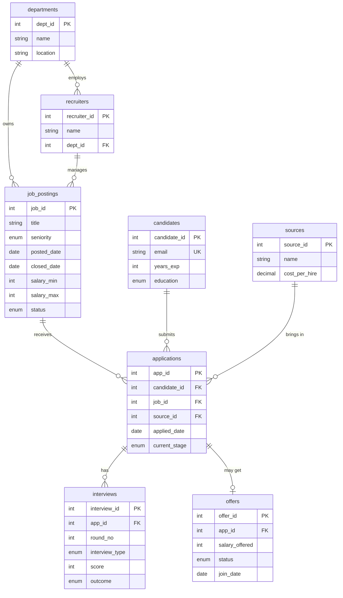

# TalentFlow — Talent Acquisition Analytics (MySQL)

A recruiting-analytics project built on **MySQL 8**. It models a company's full hiring funnel (job posting → application → interview → offer → hire) and answers 12 business questions that recruiters and HR leaders actually ask. It also ships a **web dashboard** that runs those queries live.

**Skills shown:** relational modelling · constraints & indexes · views · CTEs · window functions (`RANK`, `LAG`, `FIRST_VALUE`, rolling averages) · correlated subqueries · transactions · a REST API over SQL.

---

## Dashboard

| Page | What it shows |
|---|---|
| **Overview** | KPI cards, hiring funnel, monthly applications vs. hires, source conversion vs. cost, department speed |
| **Job Postings** | Every requisition with a live pipeline bar. Click a job to see its applicants. You can create new postings |
| **Candidates** | Searchable, filterable list of 1,400+ applications. Change a stage to move a candidate through the funnel |
| **Recruiters** | Scorecard with offers, hires, acceptance rate and days to hire |
| **SQL Explorer** | All 12 analysis queries with syntax highlighting, run live against MySQL |

Moving a candidate to **Hired** runs in a single transaction: it creates or accepts the offer, sets the join date, and marks the job **Filled** once every opening is taken.

> Add screenshots here: `docs/overview.png`, `docs/sql-explorer.png`

---

## Quick start

### Option 1: Demo mode (only Node.js needed, no Docker or MySQL install)

Requires **Node.js 18+**. Nothing else.

```bash
cd app
npm install
npm run demo
```

Then open **http://localhost:4000**.

This starts a real, temporary MySQL 8.4 server inside Node (using [`mysql-memory-server`](https://www.npmjs.com/package/mysql-memory-server)) and loads the schema, data and views automatically.
- The first run downloads a portable MySQL build (a few hundred MB, one time only). Later runs start in seconds.
- Data resets every time you restart. Press `Ctrl+C` to stop.

### Option 2: Docker (a persistent database you can connect to with Workbench)

Requires **Docker** and **Node.js 18+**.

```bash
docker compose up -d          # MySQL on port 3307; loads schema, data and views on first run
cd app
cp .env.example .env
npm install
npm start
```

Connect with any MySQL client on `127.0.0.1:3307` (user `root`, password `talent123`), or:

```bash
docker exec -it ta-mysql mysql -uroot -ptalent123 talent_acquisition
```

Reset to the original seed with `docker compose down -v && docker compose up -d`.

### Option 3: Your own MySQL installation

```bash
mysql -u root -p < sql/01_schema.sql
mysql -u root -p < sql/02_seed_data.sql
mysql -u root -p < sql/03_views.sql
```

Then put your credentials in `app/.env` (copy it from `.env.example`) and run `npm install && npm start` inside `app/`.

---

## Project structure

```
HR-sql/
├── sql/
│   ├── 01_schema.sql        # 8 tables with PKs, FKs, CHECKs, UNIQUEs, indexes
│   ├── 02_seed_data.sql     # generated sample data (see scripts/)
│   ├── 03_views.sql         # 5 reusable views
│   └── 04_queries.sql       # 12 business questions (Beginner → Advanced)
├── scripts/
│   └── generate_seed.py     # reproducible data generator (random.seed(42))
├── app/
│   ├── server.js            # Express + mysql2 REST API
│   ├── demo.js              # zero-install mode: embedded MySQL + server
│   └── public/              # dashboard (HTML/CSS/JS + Chart.js)
└── docker-compose.yml
```

---

## Data model



**Dataset:** 6 departments · 10 recruiters · 6 sources · 64 job postings · 520 candidates · 1,406 applications · 867 interviews · 179 offers · 123 hires (Jan 2025 – Sep 2026).

The seed data is simulated rather than random. Each source has its own quality, senior roles are harder to fill, referrals accept offers more often, and low offers get declined more. That's why the queries surface real patterns.

---

## Business questions

| # | Level | Question | SQL techniques |
|---|---|---|---|
| Q1 | Beginner | Open positions by department | `JOIN`, `GROUP BY` |
| Q2 | Beginner | Applicant volume by source | `LEFT JOIN`, `SUM() OVER ()` for share % |
| Q3 | Beginner | Average offer vs. posted salary band | multi-table join, aggregates |
| Q4 | Intermediate | Time-to-hire by department | view, `DATEDIFF`, `MIN/MAX/AVG` |
| Q5 | Intermediate | Funnel conversion rates | `LAG()`, `FIRST_VALUE()` |
| Q6 | Intermediate | Offer acceptance rate by recruiter | conditional aggregation, `NULLIF` |
| Q7 | Intermediate | Cost per hire & ROI by source | `RANK()` on two metrics |
| Q8 | Advanced | Recruiter leaderboard by quarter | chained CTEs, `RANK() OVER (PARTITION BY …)` |
| Q9 | Advanced | Month-over-month application trend | `LAG()`, 3-month rolling `AVG … ROWS BETWEEN` |
| Q10 | Advanced | Stale requisitions (open longer than dept avg) | CTE + correlated subquery |
| Q11 | Advanced | Repeat applicants never interviewed | `NOT EXISTS`, `HAVING`, `GROUP_CONCAT` |
| Q12 | Advanced | Do interview scores predict hires? | pivot with `CASE` inside `AVG` |

---

## Key findings

1. **Referrals are the best channel by far.** They are 11.6% of applicants but 32% of hires (39 of 123), with a 23.9% application-to-hire rate.
2. **Naukri brings volume, not hires.** It's the second-largest source (23.8% of applicants) but converts at only 1.2%. That budget is a candidate to move.
3. **Agencies convert well but cost 6× more than referrals** (₹1.5L vs ₹25K per hire). They're best kept for hard-to-fill senior roles.
4. **The biggest funnel leak is at the top.** Only 54% of applicants pass screening, and just 8.7% of all applicants end up hired.
5. **Offer acceptance ranges from 59% to 86% across recruiters.** That gap points to coaching opportunities in closing and offer calibration.
6. **Average time to hire is about 28 days.** Marketing is the slowest at 32.5 days.
7. **Interview scores do predict hiring,** and the HR round shows the widest score gap (1.0 points). The phone screen is the weakest signal.

---

## Regenerating data

```bash
python3 scripts/generate_seed.py      # rewrites sql/02_seed_data.sql
docker compose down -v && docker compose up -d
```
